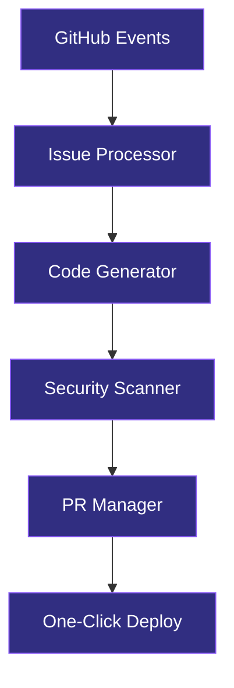

<div align="center">

<picture>
  <source media="(prefers-color-scheme: dark)" srcset="assets/brand/ship-icon-dark.svg">
  <source media="(prefers-color-scheme: light)" srcset="assets/brand/ship-icon-light.svg">
  
</picture>

# Ship

### Ship faster with AI that codes with you

[](https://github.com/likhonsex/Ship/actions)
[](https://github.com/likhonsex/Ship/graphs/contributors)
[](https://github.com/likhonsex/Ship/stargazers)
[](https://github.com/likhonsex/Ship/issues)
[](LICENSE)
[](https://opencollective.com/ship)

[**Get Started**](#-getting-started) · [**Documentation**](AGENTS.md) · [**Report Bug**](https://github.com/likhonsex/Ship/issues/new?template=bug_report.md) · [**Request Feature**](https://github.com/likhonsex/Ship/issues/new?template=feature_request.md)

</div>

---

## From Prototype to Production in One Place

Built on the platform trusted by **over 150 million developers**, Ship gives you the smoothest path from idea to deployment.

> [!NOTE]
> Ship is an autonomous AI coding agent that works directly in your GitHub workflow.

---

## Table of Contents

- [About](#-about)
- [Features](#-features)
- [Getting Started](#-getting-started)
- [Architecture](#-architecture)
- [Roadmap](#-roadmap)
- [Contributing](#-contributing)
- [License](#-license)

---

## 🚀 About

**Ship** assigns issues directly to AI and lets it autonomously write code, create pull requests, and respond to feedback — all in the background.

> *From edits to pull requests, the world's best coding agents work beside you so nothing slows you down.*

### Build and Iterate Your Way

Natural language, clickable controls, or code—use whatever feels right. Live preview updates instantly as you build.

| Input Method | Description |
|:-------------|:------------|
| **Natural Language** | Describe what you want in plain English |
| **Clickable Controls** | Use intuitive UI to guide the AI |
| **Code** | Write code directly when you prefer |
| **Live Preview** | See changes instantly as you build |

---

## 🔒 Secure and Ship Quality Code

> [!IMPORTANT]
> Deploy with confidence as Ship helps you find and fix vulnerabilities in real time.

<div align="center">

### ✨ Dream it. See it. Ship it. ✨

</div>

| Security Feature | Description |
|:-----------------|:------------|
| **Vulnerability Detection** | Find security issues before they reach production |
| **Real-time Fixes** | Get instant suggestions to fix vulnerabilities |
| **Code Quality** | Automated code review and best practices |
| **Dependency Scanning** | Monitor and update dependencies safely |

---

## ⭐ Features

| Feature | Description |
|:--------|:------------|
| 🤖 **Issue Assignment** | Assign issues directly to Ship |
| 💻 **Autonomous Coding** | AI writes code based on requirements |
| 🔀 **Auto PR Creation** | Creates well-formatted pull requests |
| 💬 **Feedback Response** | Responds to code review comments |
| 🧠 **Multi-Provider LLM** | OpenAI, Claude, Groq, Ollama support |
| 🚀 **One-Click Deploy** | Transform ideas to deployed apps instantly |

<details>
<summary><strong>View All GitHub Actions Workflows</strong></summary>

| Workflow | Description | Trigger |
|:---------|:------------|:--------|
| **Ship Agent** | Process assigned issues with AI | `issues.assigned` |
| **Code Review** | AI-powered code review | `pull_request` |
| **Security Scan** | Find vulnerabilities in real time | `push` |
| **Auto Deploy** | Deploy on merge to main | `push` to `main` |
| **Test Runner** | Run tests on PR | `pull_request` |

</details>

---

## 🏗️ Architecture



<details>
<summary><strong>View Tech Stack</strong></summary>

| | Technology | Purpose |
|:---:|:-----------|:--------|
| ⚡ | **Vercel AI SDK** | Unified LLM interface |
| ⚛️ | **Next.js 14** | Frontend & API routes |
| 📘 | **TypeScript** | Type-safe development |
| 🐙 | **GitHub API** | Issue & PR management |
| 🔒 | **Security Scanner** | Vulnerability detection |
| 🗄️ | **Supabase** | Database (optional) |

</details>

---

## 📦 Getting Started

### Prerequisites

> [!WARNING]
> Ensure you have the following installed before proceeding.

```bash
node >= 18.0.0
npm >= 9.0.0
```

### Installation

1. **Clone the repository**
   ```bash
   git clone https://github.com/likhonsex/Ship.git
   cd Ship
   ```

2. **Install dependencies**
   ```bash
   npm install
   ```

3. **Configure environment**
   ```bash
   cp .env.example .env
   ```

4. **Start development server**
   ```bash
   npm run dev
   ```

### Environment Variables

| Variable | Required | Description |
|:---------|:--------:|:------------|
| `GITHUB_TOKEN` | ✅ | GitHub access token |
| `OPENAI_API_KEY` | ✅[^1] | OpenAI API key |
| `ANTHROPIC_API_KEY` | ➖ | Claude API key |
| `GROQ_API_KEY` | ➖ | Groq API key |

[^1]: At least one LLM provider key is required.

---

## 🗺️ Roadmap

- [x] Core issue processor
- [x] AI code generation
- [x] GitHub Actions integration
- [x] Security vulnerability scanning
- [x] Live preview updates
- [ ] Multi-provider LLM support
- [ ] Advanced PR management
- [ ] Feedback loop automation
- [ ] One-click deploy integration
- [ ] VS Code extension

See the [open issues](https://github.com/likhonsex/Ship/issues) for a full list of proposed features.

---

## 🤝 Contributing

> [!TIP]
> Contributions make the open source community an amazing place to learn, inspire, and create.

1. **Fork the Project**
2. **Create your Feature Branch** (`git checkout -b feature/AmazingFeature`)
3. **Commit your Changes** (`git commit -m 'Add AmazingFeature'`)
4. **Push to the Branch** (`git push origin feature/AmazingFeature`)
5. **Open a Pull Request**

See [AGENTS.md](AGENTS.md) for agent development guidelines.

---

## 📄 License

Distributed under the **MIT License**. See [`LICENSE`](LICENSE) for more information.

---

## 💖 Support

<div align="center">

[](https://github.com/sponsors/likhonsex)
[](https://opencollective.com/ship)

</div>

---

<div align="center">

<picture>
  <source media="(prefers-color-scheme: dark)" srcset="assets/brand/ship-icon-dark.svg">
  <source media="(prefers-color-scheme: light)" srcset="assets/brand/ship-icon-light.svg">
  
</picture>

### From Prototype to Production

**✨ Dream it. See it. Ship it. ✨**

Built on the platform trusted by over 150 million developers

[GitHub](https://github.com/likhonsex/Ship) · [Issues](https://github.com/likhonsex/Ship/issues) · [Discussions](https://github.com/likhonsex/Ship/discussions)

</div>

<!-- Hidden: This README was crafted using GitHub Flavored Markdown best practices -->
