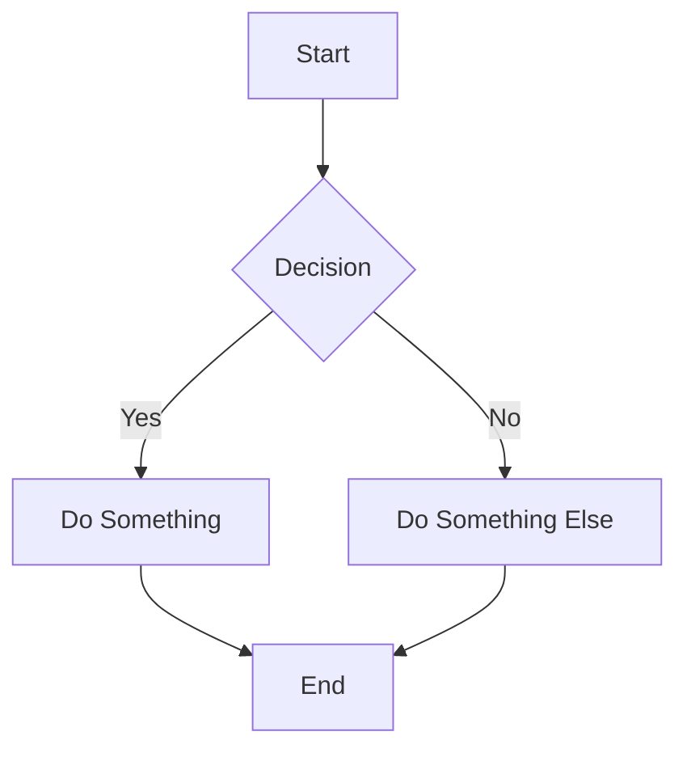
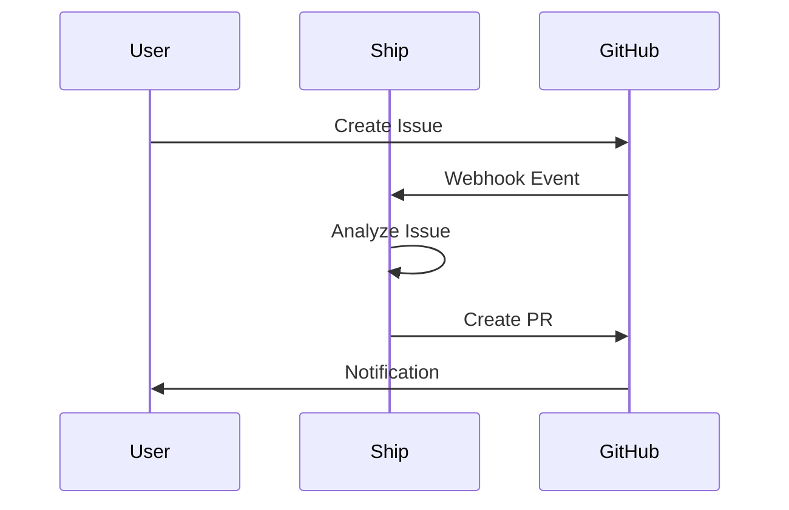
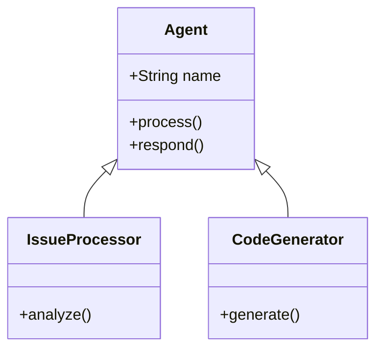
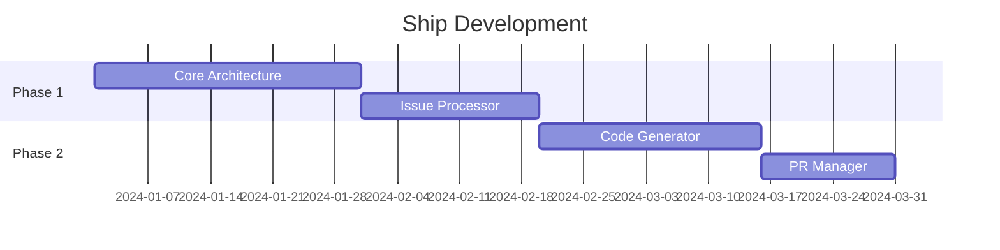
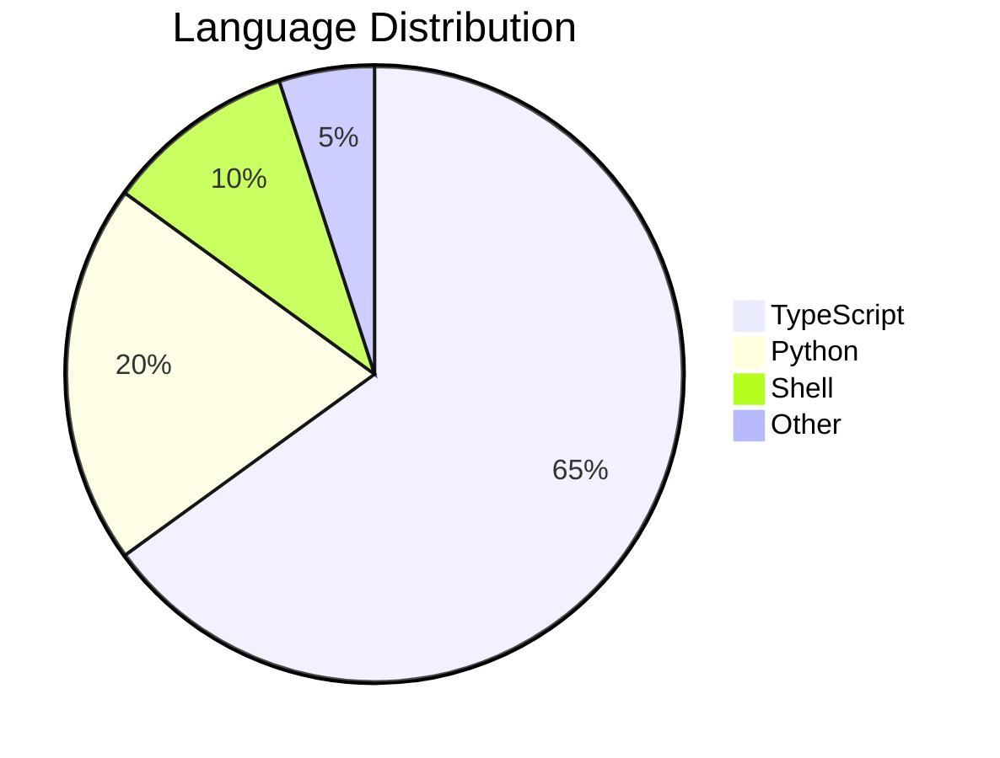

# ✍️ Advanced Markdown Guide

Master GitHub Flavored Markdown (GFM) for professional documentation, issues, and pull requests.

---

## Table of Contents

- [Tables](#tables)
- [Collapsed Sections](#collapsed-sections)
- [Code Blocks](#code-blocks)
- [Diagrams](#diagrams)
- [Mathematical Expressions](#mathematical-expressions)
- [Autolinked References](#autolinked-references)
- [Task Lists](#task-lists)
- [Alerts](#alerts)
- [Footnotes](#footnotes)
- [Permanent Code Links](#permanent-code-links)
- [Keywords](#keywords)

---

## Tables

Organize information clearly with tables.

### Basic Syntax

```markdown
| Header 1 | Header 2 | Header 3 |
|----------|----------|----------|
| Cell 1   | Cell 2   | Cell 3   |
| Cell 4   | Cell 5   | Cell 6   |
```

**Renders as:**

| Header 1 | Header 2 | Header 3 |
|----------|----------|----------|
| Cell 1   | Cell 2   | Cell 3   |
| Cell 4   | Cell 5   | Cell 6   |

### Alignment

```markdown
| Left | Center | Right |
|:-----|:------:|------:|
| L    |   C    |     R |
```

| Left | Center | Right |
|:-----|:------:|------:|
| L    |   C    |     R |

### Complex Tables

```markdown
| Feature | Status | Notes |
|---------|:------:|-------|
| Authentication | ✅ | OAuth 2.0 |
| API Rate Limiting | ✅ | 1000 req/min |
| WebSocket | 🚧 | In progress |
| GraphQL | ❌ | Planned Q2 |
```

| Feature | Status | Notes |
|---------|:------:|-------|
| Authentication | ✅ | OAuth 2.0 |
| API Rate Limiting | ✅ | 1000 req/min |
| WebSocket | 🚧 | In progress |
| GraphQL | ❌ | Planned Q2 |

---

## Collapsed Sections

Streamline long content with expandable sections.

### Basic Syntax

```markdown
<details>
<summary>Click to expand</summary>

Hidden content goes here.

- Item 1
- Item 2
- Item 3

</details>
```

**Renders as:**

<details>
<summary>Click to expand</summary>

Hidden content goes here.

- Item 1
- Item 2
- Item 3

</details>

### Open by Default

```markdown
<details open>
<summary>Already expanded</summary>

This section starts open.

</details>
```

<details open>
<summary>Already expanded</summary>

This section starts open.

</details>

### Nested Collapsibles

```markdown
<details>
<summary>📁 Project Structure</summary>

<details>
<summary>📂 src/</summary>

- `index.ts`
- `utils.ts`
- `types.ts`

</details>

<details>
<summary>📂 tests/</summary>

- `index.test.ts`
- `utils.test.ts`

</details>

</details>
```

<details>
<summary>📁 Project Structure</summary>

<details>
<summary>📂 src/</summary>

- `index.ts`
- `utils.ts`
- `types.ts`

</details>

<details>
<summary>📂 tests/</summary>

- `index.test.ts`
- `utils.test.ts`

</details>

</details>

---

## Code Blocks

### Fenced Code Blocks

````markdown
```javascript
function hello() {
  console.log('Hello, World!');
}
```
````

```javascript
function hello() {
  console.log('Hello, World!');
}
```

### Supported Languages

| Language | Identifier |
|----------|------------|
| JavaScript | `javascript`, `js` |
| TypeScript | `typescript`, `ts` |
| Python | `python`, `py` |
| Bash | `bash`, `sh`, `shell` |
| JSON | `json` |
| YAML | `yaml`, `yml` |
| Markdown | `markdown`, `md` |
| Diff | `diff` |
| SQL | `sql` |
| GraphQL | `graphql` |

### Diff Highlighting

```markdown
```diff
- const old = 'removed';
+ const new = 'added';
```
```

```diff
- const old = 'removed';
+ const new = 'added';
```

### Inline Code

```markdown
Run `npm install` to install dependencies.
```

Run `npm install` to install dependencies.

---

## Diagrams

Create diagrams with Mermaid syntax.

### Flowchart

````markdown

````


### Sequence Diagram

````markdown

````


### Class Diagram

````markdown

````


### Gantt Chart

````markdown

````


### Pie Chart

````markdown

````


---

## Mathematical Expressions

Write math with LaTeX syntax using `$` delimiters.

### Inline Math

```markdown
The quadratic formula is $x = \frac{-b \pm \sqrt{b^2 - 4ac}}{2a}$
```

The quadratic formula is $x = \frac{-b \pm \sqrt{b^2 - 4ac}}{2a}$

### Block Math

```markdown
$$
\sum_{i=1}^{n} x_i = x_1 + x_2 + \cdots + x_n
$$
```

$$
\sum_{i=1}^{n} x_i = x_1 + x_2 + \cdots + x_n
$$

### Common Expressions

| Expression | LaTeX |
|------------|-------|
| Fraction | `\frac{a}{b}` |
| Square root | `\sqrt{x}` |
| Exponent | `x^2` |
| Subscript | `x_i` |
| Sum | `\sum_{i=1}^{n}` |
| Integral | `\int_a^b` |
| Greek letters | `\alpha`, `\beta`, `\pi` |

---

## Autolinked References

GitHub automatically links references.

### URLs

```markdown
Visit https://github.com/likhonsex/Ship for more info.
```

### Issues & PRs

| Reference | Example | Links to |
|-----------|---------|----------|
| `#123` | #123 | Issue/PR in same repo |
| `owner/repo#123` | likhonsex/Ship#1 | Issue/PR in different repo |
| `GH-123` | GH-123 | Issue/PR (alternative) |

### Commits

| Reference | Example |
|-----------|----------|
| Full SHA | `a1b2c3d4e5f6...` |
| Short SHA | `a1b2c3d` |
| `owner/repo@SHA` | `likhonsex/Ship@a1b2c3d` |

### Users & Teams

```markdown
@likhonsex - Mentions a user
@org/team-name - Mentions a team
```

---

## Task Lists

Track progress with interactive checkboxes.

### Basic Syntax

```markdown
- [x] Completed task
- [ ] Incomplete task
- [ ] Another task
```

- [x] Completed task
- [ ] Incomplete task
- [ ] Another task

### Nested Tasks

```markdown
- [ ] Main task
  - [x] Subtask 1
  - [ ] Subtask 2
  - [ ] Subtask 3
```

- [ ] Main task
  - [x] Subtask 1
  - [ ] Subtask 2
  - [ ] Subtask 3

### In Issues/PRs

Task lists in issue/PR bodies show completion progress:

```markdown
## Checklist

- [x] Design approved
- [x] Tests written
- [ ] Code reviewed
- [ ] Documentation updated
```

Displays as: **2 of 4 tasks**

---

## Alerts

Highlight important information with alert blocks.

### Syntax

```markdown
> [!NOTE]
> Useful information that users should know.

> [!TIP]
> Helpful advice for doing things better.

> [!IMPORTANT]
> Key information users need to know.

> [!WARNING]
> Urgent info that needs immediate attention.

> [!CAUTION]
> Advises about risks or negative outcomes.
```

### Renders as:

> [!NOTE]
> Useful information that users should know.

> [!TIP]
> Helpful advice for doing things better.

> [!IMPORTANT]
> Key information users need to know.

> [!WARNING]
> Urgent info that needs immediate attention.

> [!CAUTION]
> Advises about risks or negative outcomes.

---

## Footnotes

Add references at the bottom of your content.

### Syntax

```markdown
Here's a statement that needs a citation[^1].

Another claim with a different source[^note].

[^1]: This is the first footnote.
[^note]: Named footnotes work too.
```

**Renders as:**

Here's a statement that needs a citation[^1].

Another claim with a different source[^note].

[^1]: This is the first footnote.
[^note]: Named footnotes work too.

---

## Permanent Code Links

Create permanent links to specific lines of code.

### How to Create

1. Navigate to the file on GitHub
2. Click the line number (e.g., line 10)
3. Hold Shift and click another line for a range (e.g., lines 10-20)
4. Click the `...` menu → **Copy permalink**

### Syntax

```markdown
https://github.com/owner/repo/blob/SHA/path/file.ts#L10-L20
```

### Example

```markdown
See the implementation:
https://github.com/likhonsex/Ship/blob/main/src/index.ts#L1-L10
```

> [!TIP]
> Use permalinks (with commit SHA) instead of branch links so the reference doesn't break when code changes.

---

## Keywords

Use keywords to link and manage issues/PRs.

### Closing Keywords

These keywords in a PR description or commit message will **close** the linked issue when merged:

| Keyword | Example |
|---------|----------|
| `close` | Closes #123 |
| `closes` | Closes #123 |
| `closed` | Closed #123 |
| `fix` | Fixes #123 |
| `fixes` | Fixes #123 |
| `fixed` | Fixed #123 |
| `resolve` | Resolves #123 |
| `resolves` | Resolves #123 |
| `resolved` | Resolved #123 |

### Multiple Issues

```markdown
This PR fixes #123, closes #456, and resolves #789.
```

### Cross-Repository

```markdown
Fixes likhonsex/Ship#123
```

### Duplicate Keywords

```markdown
Duplicate of #123
```

---

## Quick Reference Card

| Feature | Syntax |
|---------|--------|
| **Bold** | `**text**` |
| *Italic* | `*text*` |
| ~~Strikethrough~~ | `~~text~~` |
| `Code` | `` `code` `` |
| [Link](url) | `[text](url)` |
| Image | `` |
| Heading | `# H1` to `###### H6` |
| Blockquote | `> quote` |
| Horizontal rule | `---` |
| Line break | Two spaces + Enter |
| Escape | `\*literal asterisks\*` |

---

## Theme-Aware Images

Show different images for light/dark mode:

```html
<picture>
  <source media="(prefers-color-scheme: dark)" srcset="dark-image.svg">
  <source media="(prefers-color-scheme: light)" srcset="light-image.svg">
  
</picture>
```

---

<div align="center">

**[↑ Back to top](#%EF%B8%8F-advanced-markdown-guide)**

Ship 💜 Documentation

</div>
