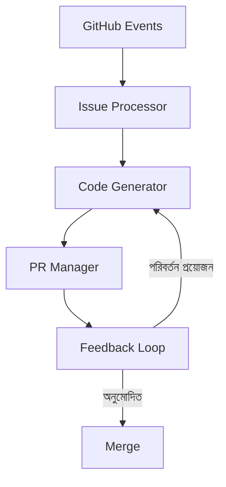

<div align="center">

<picture>
  <source media="(prefers-color-scheme: dark)" srcset="../../assets/brand/ship-icon-dark.svg">
  <source media="(prefers-color-scheme: light)" srcset="../../assets/brand/ship-icon-light.svg">
  
</picture>

# Ship

### AI এর সাথে দ্রুত কোড করুন

[](https://github.com/likhonsex/Ship/actions)
[](LICENSE)
[](https://www.typescriptlang.org/)

[English](../../README.md) · **বাংলা**

</div>

---

> [!NOTE]
> Ship একটি স্বায়ত্তশাসিত AI কোডিং এজেন্ট যা সরাসরি আপনার GitHub ওয়ার্কফ্লোতে কাজ করে।

## 🚀 Ship কী?

Ship একটি AI-চালিত কোডিং এজেন্ট যা:

- 🎯 **GitHub Issues বিশ্লেষণ করে** এবং স্বয়ংক্রিয়ভাবে সমাধান তৈরি করে
- 💻 **কোড জেনারেট করে** আপনার প্রজেক্টের স্টাইল অনুসরণ করে
- 🔄 **Pull Requests তৈরি করে** সম্পূর্ণ ডকুমেন্টেশন সহ
- 💬 **ফিডব্যাকে সাড়া দেয়** এবং প্রয়োজনে পরিবর্তন করে

## ⚡ দ্রুত শুরু

### ১. ইনস্টলেশন

```bash
# রিপোজিটরি ক্লোন করুন
git clone https://github.com/likhonsex/Ship.git
cd Ship

# ডিপেন্ডেন্সি ইনস্টল করুন
npm install
```

### ২. এনভায়রনমেন্ট সেটআপ

```bash
# .env.example কপি করুন
cp .env.example .env
```

`.env` ফাইল এডিট করুন:

```env
# প্রয়োজনীয় (যেকোনো একটি)
OPENAI_API_KEY=sk-...
ANTHROPIC_API_KEY=sk-ant-...
GROQ_API_KEY=gsk_...

# GitHub
GITHUB_TOKEN=ghp_...
```

### ৩. চালু করুন

```bash
npm run dev
```

## 🏗️ আর্কিটেকচার



## 📚 ডকুমেন্টেশন

| ডক | বিবরণ |
|-----|-------------|
| [AGENTS.md](./AGENTS.md) | এজেন্ট বিস্তারিত |
| [CONTRIBUTING.md](./CONTRIBUTING.md) | অবদান গাইড |
| [GETTING_STARTED.md](./GETTING_STARTED.md) | শুরু করার গাইড |

## 🤝 অবদান রাখুন

আমরা সব ধরনের অবদান স্বাগত জানাই! বিস্তারিত জানতে [CONTRIBUTING.md](./CONTRIBUTING.md) দেখুন।

## 📄 লাইসেন্স

MIT License - বিস্তারিত জানতে [LICENSE](../../LICENSE) দেখুন।

---

<div align="center">

**[⬆ উপরে যান](#ship)**

Ship 💜 দিয়ে তৈরি

</div>